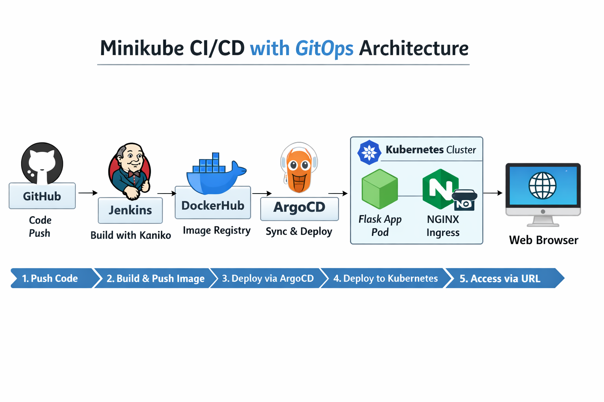
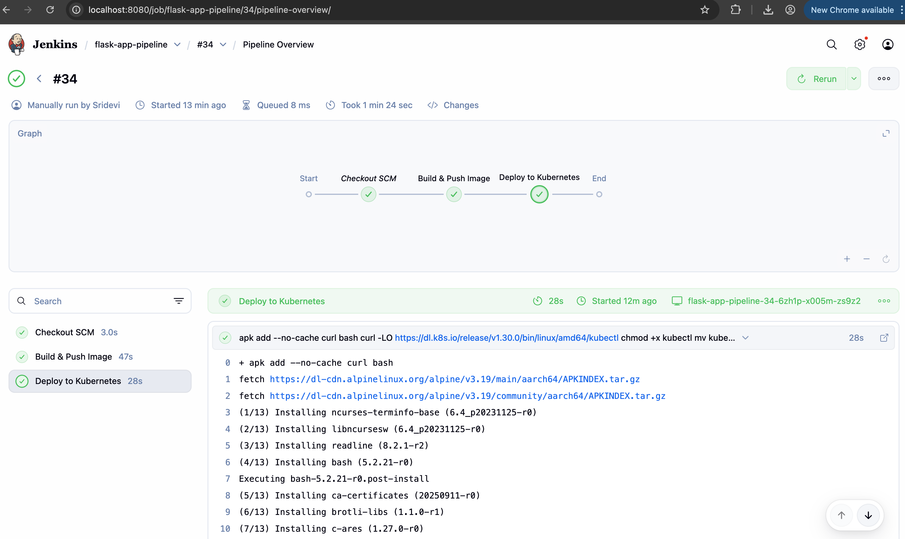
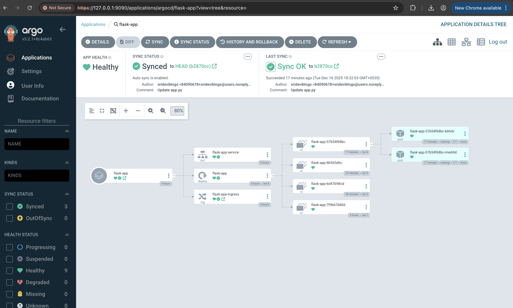
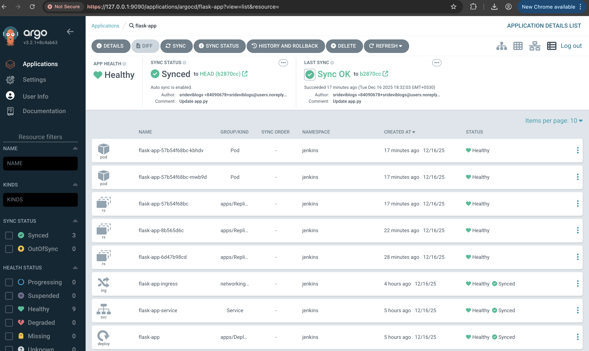
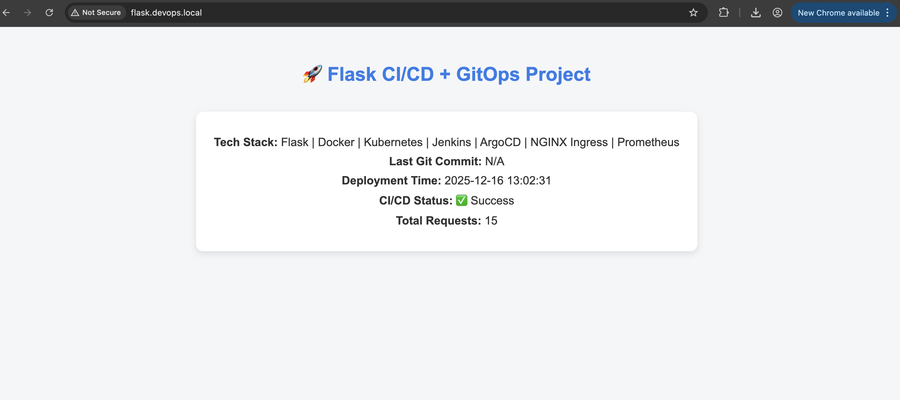

# CI/CD with GitOps

**Project Overview:**  
This project demonstrates a full **CI/CD pipeline** using **Jenkins**, **Kaniko**, **ArgoCD**, and **Kubernetes** on **Minikube**. It automates building, pushing, and deploying a Python Flask application following **GitOps principles**.  

---


## 🛠 Tech Stack

- **CI/CD:** Jenkins, Kaniko  
- **GitOps:** ArgoCD  
- **Container Registry:** DockerHub  
- **Container Orchestration:** Kubernetes (Minikube)  
- **Ingress:** NGINX  
- **Application:** Flask

---

## Architecture

  
*Flow: GitHub → Jenkins (Kaniko) → DockerHub → ArgoCD → Kubernetes Pods → NGINX Ingress → Browser*

**Flow:**

1. Push code to GitHub
2. Jenkins picks up the commit and builds the Docker image using **Kaniko**
3. Push the image to **DockerHub**
4. **ArgoCD** syncs the deployment manifest from GitHub to the Kubernetes cluster
5. Kubernetes deploys the **Flask app**
6. App is accessible via **NGINX Ingress** at `http://flask.devops.local`

---

## ⚙️ CI/CD Pipeline (Jenkins)

  
*Pipeline stages: Checkout, Build & Push, Deploy to Kubernetes via ArgoCD*


---

## Application Deployment

**Kubernetes Resources (Jenkins namespace):**

```bash
kubectl get pods -n jenkins
kubectl get svc -n jenkins
kubectl get ingress -n jenkins
```

---

## ArgoCD Dashboard

Shows the Flask app synced and healthy with automated GitOps deployment.






## Access the Application

URL: http://flask.devops.local/

----

## Key Features

Fully automated CI/CD pipeline using Jenkins and Kaniko

ArgoCD for GitOps-based deployment and sync

NGINX Ingress exposes the application with a friendly URL

Modular and namespace-aware deployment

Ready for Prometheus monitoring

## Future Improvements

Integrate Prometheus and Grafana for metrics and visualization

Add unit tests and linting for automated code quality checks

Deploy in a multi-node cluster for high availability

---

## Project Status

Fully deployed and running  
Flask app live at `http://flask.devops.local/`
 

