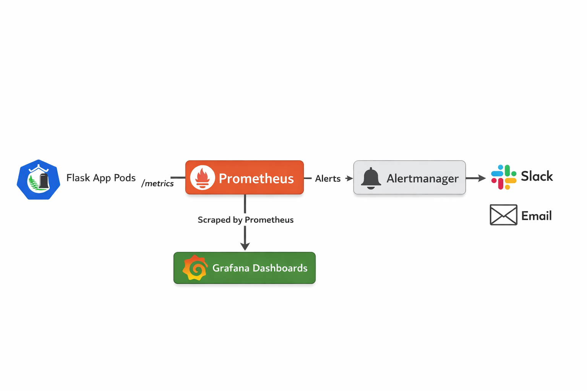
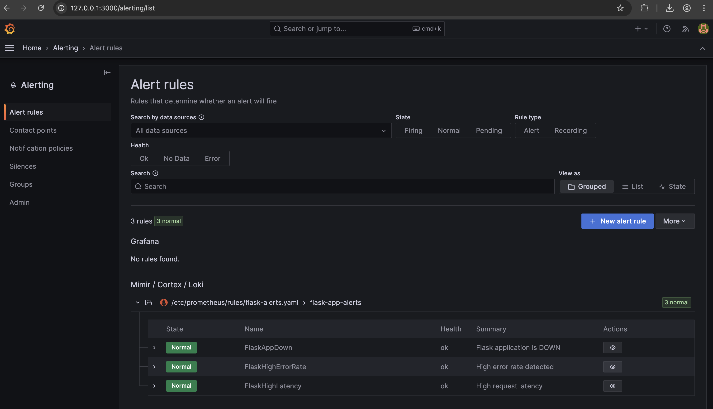

# Flask Application Monitoring with Prometheus & Grafana

## Project Overview
This project demonstrates **end-to-end monitoring and alerting** for a Flask application deployed on **Kubernetes** using **Prometheus** and **Grafana**.

It showcases how application-level metrics can be collected, visualized, and used to trigger alerts for proactive monitoring in a cloud-native environment.

### Key Highlights
- Custom Flask metrics using Prometheus client
- Real-time monitoring with Prometheus
- Grafana dashboards for visualization
- Alerting for downtime, high latency, and error rates
- Kubernetes-native deployment using ConfigMaps and Deployments

---

## Architecture

 

---

## Tech Stack

- **Backend:** Flask, Python  
- **Monitoring:** Prometheus, Alertmanager  
- **Visualization:** Grafana  
- **Containerization:** Docker  
- **Orchestration:** Kubernetes  

---

## Kubernetes Components

### Flask Application
- Deployed as a Kubernetes Deployment
- Exposes `/metrics` endpoint for Prometheus scraping
- Metrics include request count and latency

### Prometheus
- Deployed using `prom/prometheus` image
- Scrapes Flask metrics using Kubernetes service discovery
- Alert rules loaded via ConfigMap

### Grafana
- Deployed with NodePort service
- Dashboards provisioned using ConfigMaps
- Displays metrics and alerts visually

---

## Prometheus Metrics

Metrics exposed by the Flask application:

| Metric Name | Description |
|------------|------------|
| `flask_http_requests_total` | Total HTTP requests by method, endpoint, and status |
| `flask_http_request_latency_seconds` | Histogram of request latency per endpoint |

Metrics endpoint:

```text
http://<flask-app-service>:5000/metrics
```

### Prometheus Targets


---

## Alerting Rules

The following alerts are configured in Prometheus:

### FlaskAppDown
- Fires when no Flask pods are running for more than 1 minute

### FlaskHighErrorRate
- Fires when more than 5% of requests return 5xx errors

### FlaskHighLatency
- Fires when 95th percentile latency exceeds 1 second

Alerts are visible in:
- Prometheus UI (`/alerts`)
- Grafana Alerting UI

### Prometheus Alerts


---

## Grafana Dashboards

**Flask Application Monitoring Dashboard** includes:
- Application status (up/down)
- Request rate (RPS)
- Request latency (p95)
- Active alerts

Grafana URL:

```text
http://127.0.0.1:3000/
```

### Grafana Dashboard – Flask Application Monitoring


### Grafana Alerts


---

## Setup Instructions

### 1️⃣ Clone Repository

```bash
git clone https://github.com/srideviblogs/k8s-cicd.git
cd k8s-cicd
```
### 2️⃣ Build Flask Docker Image

```bash
docker build -t sridevi1902/flask-app:latest .
docker push sridevi1902/flask-app:latest
```
3️⃣ Deploy to Kubernetes

All monitoring and alerting components are organized under dedicated folders
to follow real-world Kubernetes best practices.

Deploy Prometheus (Scraping + Alert Rules)

```bash
kubectl apply -f monitoring/prometheus-configmap.yaml
kubectl apply -f monitoring/prometheus-deployment.yaml
```

Deploy Prometheus Alert Rules

```bash
kubectl apply -f k8s/alerting/flask-alert-rules.yaml
```

Deploy Grafana Dashboards

```bash
kubectl apply -f monitoring/grafana-dashboards.yaml
```

Deploy Alertmanager

```bash
kubectl apply -f monitoring/alertmanager/
```

4️⃣ Access Prometheus & Grafana

```bash
kubectl port-forward -n jenkins svc/prometheus-service 9091:9090
kubectl port-forward -n jenkins svc/grafana 3000:3000
```

Prometheus: http://127.0.0.1:9091

Grafana: http://127.0.0.1:3000


### Alert Testing

Trigger FlaskAppDown alert:

```bash
kubectl scale deployment flask-app -n jenkins --replicas=0
```

Restore application:

```bash
kubectl scale deployment flask-app -n jenkins --replicas=2
```

### Key Learnings

Instrumenting applications with Prometheus metrics

Kubernetes-native service discovery for monitoring

Writing meaningful Prometheus alert rules

Visualizing metrics and alerts using Grafana

Building production-ready observability for microservices
